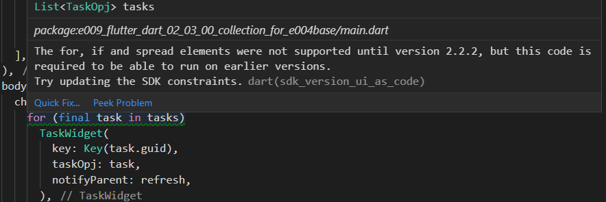

# e009_flutter_dart_02_03_00_collection_for_e004base

## Based On e007

- [elrashid-flutter-examples/e007_flutter_reorderable_listview_e004base](https://github.com/elrashid-flutter-examples/e007_flutter_reorderable_listview_e004base)

  - Based On e004 :

    - [elrashid-flutter-examples/e004_flutter_listview_crud_app_using_nonsecure_rest_api](https://github.com/elrashid-flutter-examples/e004_flutter_listview_crud_app_using_nonsecure_rest_api)

## Screen Record

## What

- used collection if and collection for introduced in Dart 2.3

- must run with :

  - [elrashid-flutter-examples/e002-aspcore-rest-api-server-for-flutter](https://github.com/elrashid-flutter-examples/e002-aspcore-rest-api-server-for-flutter)

## Step 1 - old code

    var tasks = List<TaskOpj>();
    @override
    Widget build(BuildContext context) {
        return Scaffold(
        body: ReorderableListView(
            children: _children(),
        )
    }

    List<Widget> _children() {
        var children = <Widget>[];
        for (final task in tasks)
        children.add(
            TaskWidget(
            key: Key(task.guid),
            taskOpj: task,
            notifyParent: refresh,
            ),
        );
        return children;
    }

## Step 2 - new code

    var tasks = List<TaskOpj>();
    @override
    Widget build(BuildContext context) {
        return Scaffold(
        body: ReorderableListView(
        children: <Widget>[ 
        for (final task in tasks) 
            TaskWidget(
                key: Key(task.guid),
                taskOpj: task,
                notifyParent: refresh,
            )
        ]),);}}

## Intro

here the Intro from the [flutter docs](https://dart.dev/guides/language/language-tour?#lists)
 
> Dart 2.3 introduced collection if and collection for, which you can use to build collections using conditionals (if) and repetition (for).

> Here’s an example of using collection if to create a list with three or four items in it:

>        var nav = [
>        'Home',
>        'Furniture',
>        'Plants',
>        if (promoActive) 'Outlet'
>        ];

> Here’s an example of using collection for to manipulate the items of a list before adding them to another list:

>        var listOfInts = [1, 2, 3];
>        var listOfStrings = [
>        '#0',
>        for (var i in listOfInts) '#$i'
>        ];
>        assert(listOfStrings[1] == '#1');

## The issue

up to flutter version 1.7.10 the **pubspec.yaml** file has :

    environment:
        sdk: ">=2.1.0 <3.0.0"

environment:
  sdk: ">=2.3.0 <3.0.0"

----

----

>The for, if and spread elements were not supported until version 2.2.2, but this code is required to be able to run on earlier versions.
Try updating the SDK constraints
----

## What did I do

Updated the **pubspec.yaml** f  :

    environment:
        sdk: ">=2.3.0 <3.0.0"

## Ref

- [Language tour - Dart](https://dart.dev/guides/language/language-tour?#lists)
- [flutter - Dart 2.3 for, if and spread support warning message regarding versions - Stack Overflow](https://stackoverflow.com/questions/56097475/dart-2-3-for-if-and-spread-support-warning-message-regarding-versions)
